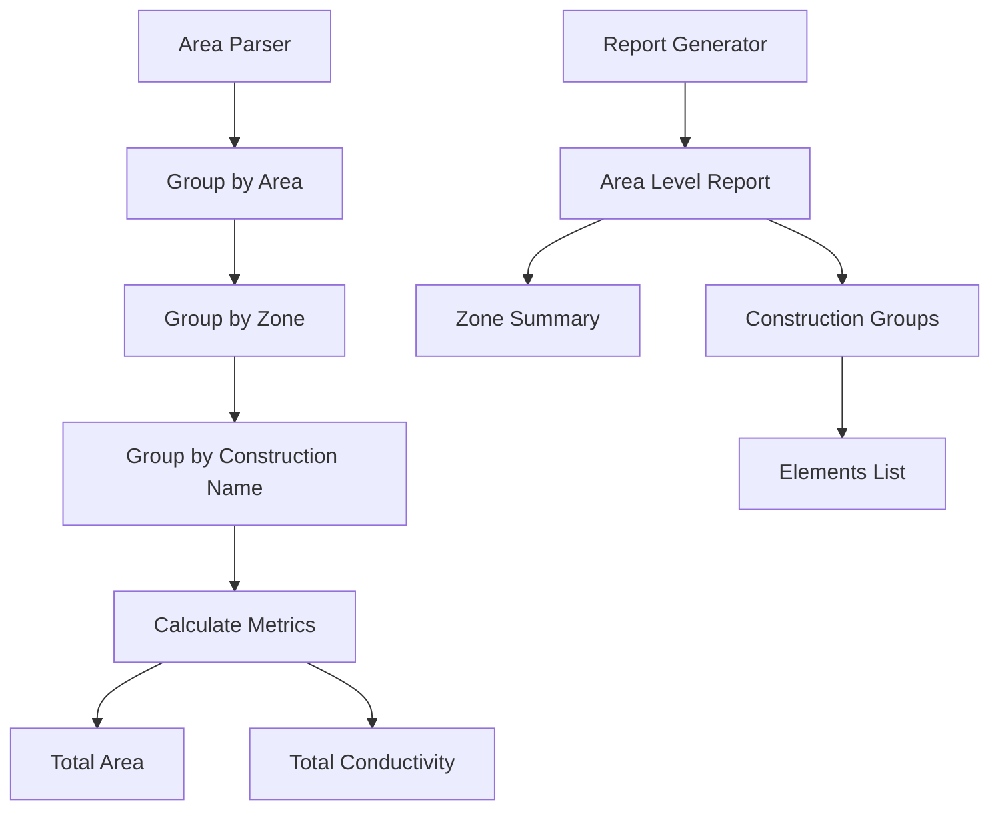

# Area Grouping Enhancement Plan

## Current Structure Analysis

- Areas are identified using area IDs extracted from zone names (e.g., "01" from "00XB1:01XLIV1")
- Elements (surfaces) are currently grouped under zones
- Element names are taken from surface names, but need to use construction names instead

## Desired Changes

- Group results first by area
- Within each area, group by zone
- Within each zone, group elements by construction name (e.g., "0_GroundFloor_0cm") instead of surface name

## Implementation Flow



## Implementation Plan

### 1. Modify AreaParser

- Update `_process_surface_batch` to extract element name from construction_name instead of surface name
- Add new data structure to group elements by construction name
- Modify data model to support hierarchical grouping

### 2. Update Report Generator

- Modify report structure to show construction-based grouping
- Add summary statistics for each construction type
- Include both zone-level and construction-level aggregations

### 3. Data Structure Changes

```python
areas_by_zone = {
    "zone_id": {
        "area_id": str,
        "properties": {...},
        "constructions": {
            "construction_name": {
                "elements": [...],
                "total_area": float,
                "total_conductivity": float
            }
        }
    }
}
```

### 4. Reporting Changes

- Group elements by construction name in PDF report
- Show subtotals for each construction type
- Maintain existing zone summaries but add construction grouping
