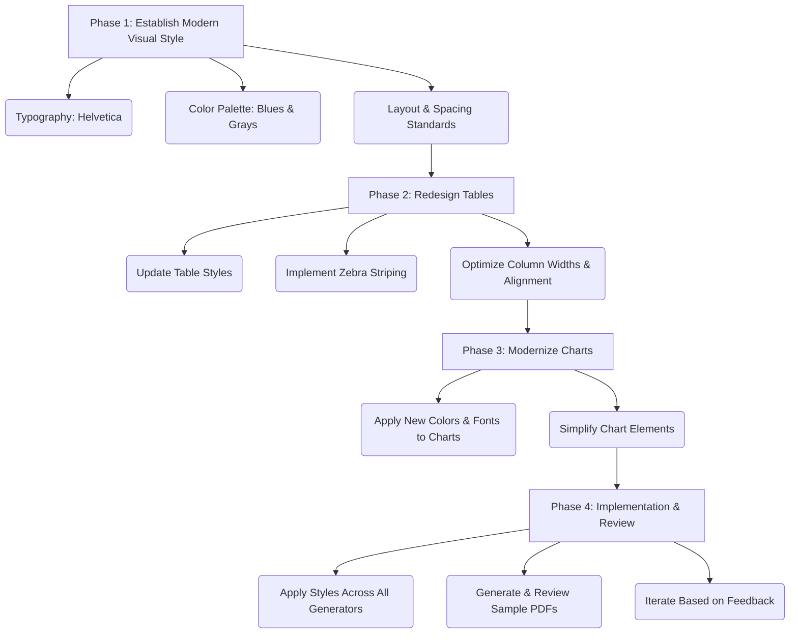

# PDF Output Redesign Plan

## Objective

To modernize the PDF outputs, making them more readable and convenient for end-users, with a focus on a clean aesthetic and clear data presentation.

## Agreed Upon Design Choices

- **Font:** Helvetica
- **Color Palette:** Based on blues and grays.

## Proposed Plan

**Phase 1: Establish a Modern Visual Style**

- **Typography:**
  - Utilize Helvetica as the primary font.
  - Define a clear typographic hierarchy (font sizes, weights) for titles, headings, subheadings, body text, and table content.
- **Color Palette:**
  - Define a professional and modern color palette using shades of blue and gray. This will replace the current mix of `navy`, `black`, `grey`, `lightgrey`, etc.
- **Layout & Spacing:**
  - Standardize page margins.
  - Utilize white space effectively to improve readability and reduce clutter.

**Phase 2: Redesign Tables for Clarity and Readability**

- **Target:** Functions like `_get_table_style` and table construction logic in PDF generator scripts.
- **Actions:**
  - Apply the new typography (Helvetica) and blue/gray color palette to table headers and content.
  - Improve grid lines: Make them more subtle (e.g., lighter gray) or use horizontal lines only.
  - Implement alternating row colors (zebra striping) for easier visual tracking.
  - Ensure consistent text alignment (left-align text, right-align numbers).
  - Optimize column widths for content visibility and readability.
  - Review header rows for clarity and conciseness.

**Phase 3: Modernize Charts**

- **Target:** Chart drawing functions (e.g., `_create_total_energy_rating_table`).
- **Actions:**
  - Apply the blue/gray color palette to chart elements.
  - Use Helvetica for all chart text.
  - Simplify chart elements (e.g., flatter bar styles, cleaner axes).
  - Ensure high contrast for readability.
  - Re-evaluate indicators (like the arrow for current grade) for clarity and modern appeal.

**Phase 4: Implementation & Review**

- Apply the decided styles systematically across all PDF generator files in the `generators/` directory.
- Generate sample PDFs for each report type.
- Review for consistency, readability, modern appeal, and data completeness.
- Iterate based on feedback.

## Mermaid Diagram of Proposed Phases

## Next Steps

1.  Confirm successful creation of this plan file.
2.  Switch to "Code" mode to begin implementation, likely starting with `generators/energy_rating_report_generator.py`.
