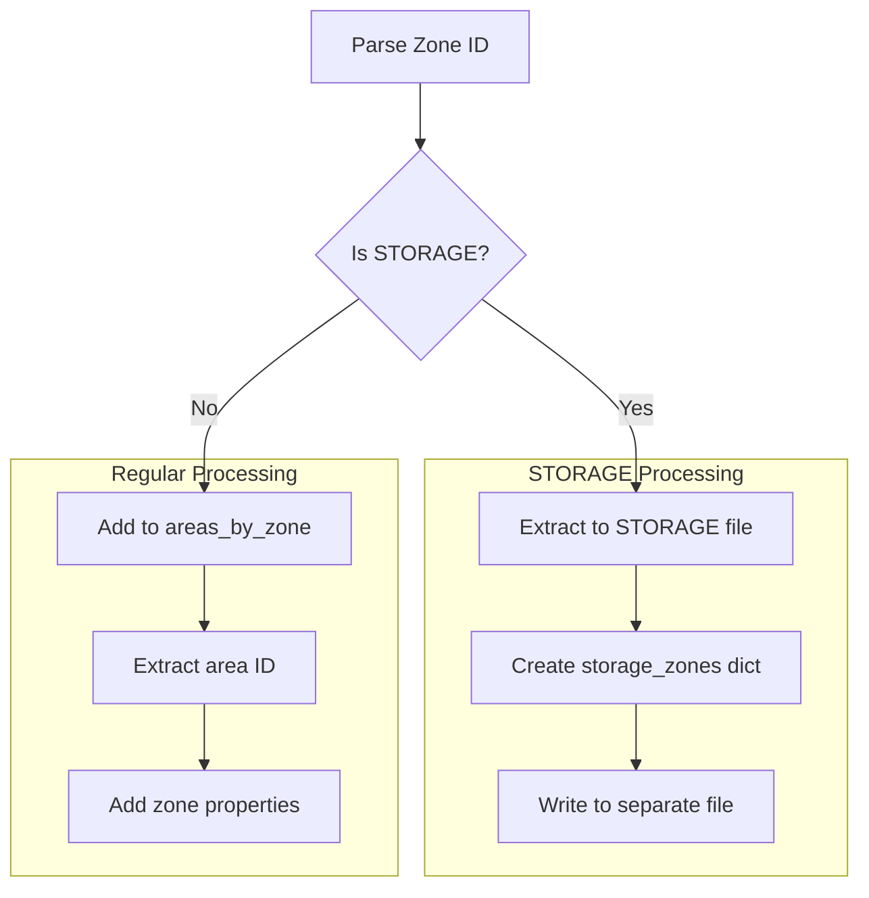

# Area Parser Refactoring Plan

## Current Understanding

- Need to handle a special zone ID format: `00XB1:STORAGE`
- These STORAGE zones should be moved to a separate file
- They should be removed from the regular areas_by_zone dictionary

## Implementation Plan



## Detailed Steps

1. **Modify AreaParser Class**

   - Add a new dictionary `storage_zones` to track STORAGE zones
   - Add method `is_storage_zone(zone_id)` to check for STORAGE pattern
   - Modify `extract_area_from_zone_id()` to handle STORAGE zones
   - Update `process_idf()` to:
     - Check for STORAGE zones
     - Route STORAGE zones to storage_zones dict
     - Keep regular zones in areas_by_zone

2. **Add New Methods**

   ```python
   def get_storage_zones(self):
       # Return storage zones dictionary

   def save_storage_zones(self, filepath):
       # Save storage zones to separate file
   ```

3. **Changes to Zone Processing Logic**

   - For regular zones: Keep current behavior
   - For STORAGE zones:
     - Extract full zone ID (00XB1:STORAGE)
     - Store zone properties in storage_zones dict
     - Skip adding to areas_by_zone

4. **File Structure**
   ```
   parsers/
   ├── area_parser.py
   └── storage/        # New directory
       └── zones.json  # Storage zones data
   ```
