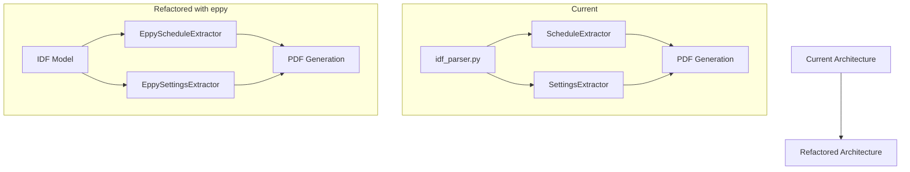

# Refactoring Plan: Migration to eppy

## Overview

This document outlines the plan to refactor the IDF reader project to use eppy instead of custom parsing logic.

## Current Architecture



## Implementation Steps

1. **Dependencies Update**

   - Add eppy to requirements.txt
   - Install required dependencies for eppy (including Energy+.idd file)

2. **Core Parser Replacement**

   - Remove custom idf_parser.py as eppy will handle parsing
   - Create a new module `eppy_handler.py` to manage IDF model loading and initialization

3. **Schedule Extractor Refactoring**

   ```mermaid
   graph LR
       A[Current ScheduleExtractor] --> B[EppyScheduleExtractor]
       B --> C[Schedule:Compact Objects]
       B --> D[Unique Pattern Detection]
       D --> E[PDF Generation]
   ```

   - Create new `EppyScheduleExtractor` class
   - Utilize eppy's built-in schedule object handling
   - Maintain existing schedule pattern detection logic
   - Keep PDF generation interface unchanged

4. **Settings Extractor Refactoring**

   ```mermaid
   graph LR
       A[Current SettingsExtractor] --> B[EppySettingsExtractor]
       B --> C[Version/RunPeriod]
       B --> D[Location Settings]
       B --> E[Ground Settings]
       C & D & E --> F[PDF Generation]
   ```

   - Create new `EppySettingsExtractor` class
   - Use eppy's object query capabilities for settings extraction
   - Map eppy objects to existing settings categories
   - Keep PDF generation interface unchanged

5. **Main Script Updates**

   ```python
   from eppy.modeleditor import IDF

   def main():
       # Initialize eppy with IDD file
       IDF.setiddname("path/to/Energy+.idd")

       # Load IDF model
       idf = IDF("input.idf")

       # Extract data using new extractors
       settings = EppySettingsExtractor(idf).get_settings()
       schedules = EppyScheduleExtractor(idf).get_parsed_unique_schedules()

       # Generate reports (unchanged)
       generate_settings_pdf(settings, "output/settings.pdf")
       generate_schedules_pdf(schedules, "output/schedules.pdf")
   ```

6. **Testing Integration**

   - Create test fixtures using eppy's test utilities
   - Update existing tests to work with eppy models
   - Add new tests for eppy-specific functionality

7. **Documentation Update**
   - Add eppy setup instructions
   - Document new eppy-based extractor classes
   - Update usage examples

## Benefits

1. **Reliability**: eppy provides robust IDF file parsing and validation
2. **Maintainability**: Removes need for custom parsing logic
3. **Extensibility**: Easy access to additional IDF features through eppy
4. **Performance**: eppy's optimized parsing and object handling
5. **Compatibility**: Better support for different IDF versions

## Risks and Mitigations

1. **Risk**: eppy dependency management

   - Mitigation: Clear documentation of setup requirements
   - Mitigation: Version pinning in requirements.txt

2. **Risk**: Different object handling between custom parser and eppy

   - Mitigation: Thorough testing of extracted data
   - Mitigation: Validation of PDF output format

3. **Risk**: Migration complexity
   - Mitigation: Phased approach, one extractor at a time
   - Mitigation: Maintain existing interfaces for PDF generation
