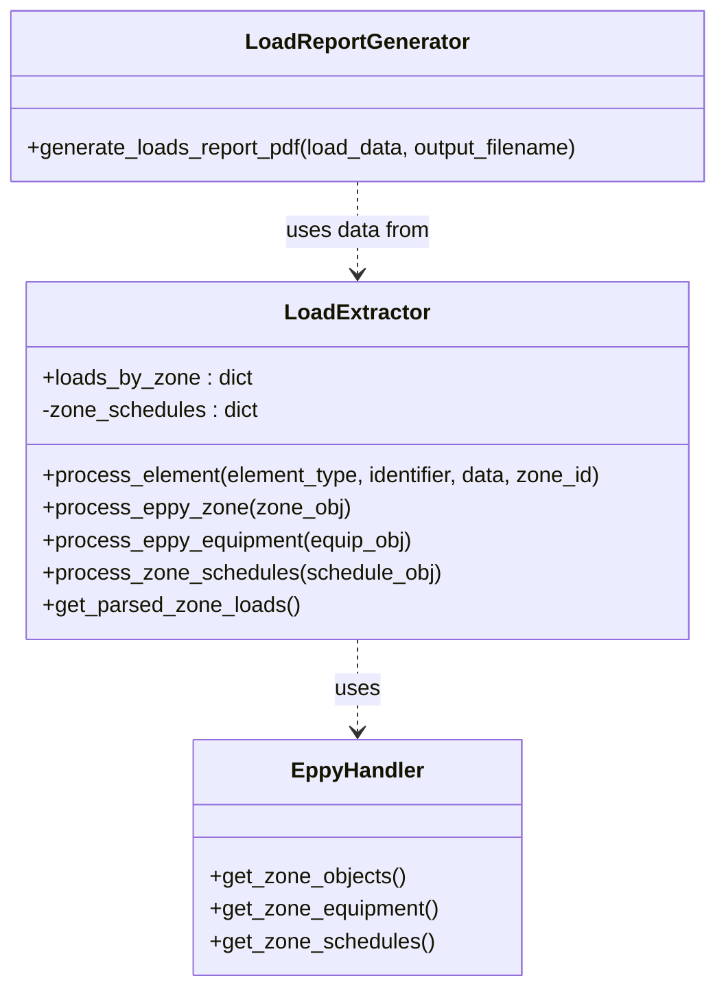

# Load Parser and Generator Implementation Plan

## Overview

Create a new parser and generator to analyze and report on loads and schedules for each zone in the IDF file.

## Class Structure



## Implementation Details

### 1. Load Parser (parsers/load_parser.py)

- Create LoadExtractor class to process and store zone load data
- Track loads by zone using dictionary structure:

```python
loads_by_zone = {
    "zone_name": {
        "properties": {
            "area": float,
            "volume": float,
            "ceiling_height": float,
            "multiplier": int
        },
        "loads": {
            "people": [{
                "name": str,
                "calculation_method": str,
                "value": float,  # people/area or total
                "schedule": str,
                "activity_schedule": str
            }],
            "lights": [{
                "name": str,
                "calculation_method": str,
                "watts_per_area": float,
                "schedule": str
            }],
            "equipment": [{
                "name": str,
                "fuel_type": str,
                "calculation_method": str,
                "watts_per_area": float,
                "schedule": str
            }],
            "infiltration": [{
                "name": str,
                "calculation_method": str,
                "flow_rate": float,
                "schedule": str
            }]
        },
        "schedules": {
            "heating": str,
            "cooling": str,
            "lighting": str,
            "equipment": str,
            "occupancy": str
        }
    }
}
```

- Key methods:
  - process_eppy_zone(): Process zone objects for base info (area, volume)
  - process_eppy_equipment(): Process equipment in zones (lights, people, other equipment)
  - process_zone_schedules(): Process schedules linked to zone equipment
  - get_parsed_zone_loads(): Return processed data for report generation

### 2. Load Report Generator (generators/load_report_generator.py)

- Create PDF report showing:
  - Zone Summary Table:
    - Zone name
    - Floor area
    - Volume
    - Zone multiplier
  - Zone Loads Table:
    - People loads (people/m², schedule)
    - Lighting loads (W/m², schedule)
    - Equipment loads (W/m², schedule)
    - Infiltration rates
  - Zone Schedules Section:
    - Heating/cooling setpoints
    - Occupancy patterns
    - Equipment operation
    - Lighting patterns
- Use consistent PDF styling with existing reports
- Include tables and sections for clear data organization

### 3. EppyHandler Updates (utils/eppy_handler.py)

- Add new methods:
  - get_zone_objects(): Get Zone objects
  - get_zone_equipment(): Get People, Lights, OtherEquipment objects
  - get_zone_schedules(): Get Schedule:Compact objects linked to zones

### 4. Integration

- Update main.py to include new parser and generator
- Add command line options for generating load reports
- Example usage:

```python
handler = EppyHandler()
idf = handler.load_idf(idf_path)

# Parse loads
load_parser = LoadExtractor()
for zone in handler.get_zone_objects(idf):
    load_parser.process_eppy_zone(zone)

# Generate report
load_data = load_parser.get_parsed_zone_loads()
generate_loads_report_pdf(load_data, "output/loads.pdf")
```

## Next Steps

1. Switch to Code mode to implement the LoadExtractor class
2. Implement LoadReportGenerator with PDF generation
3. Add new EppyHandler methods
4. Update main.py for integration
