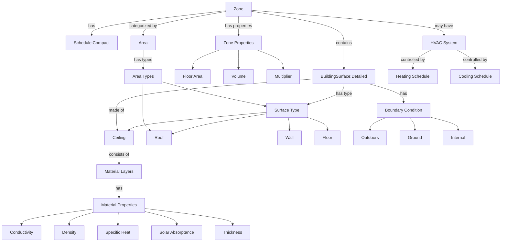

# IDF Building Model Relationship Map

## Element Relationships

## Key Relationships Explained

1. Zone-Level Relationships

   - A Zone is the primary container element
   - Contains physical properties (floor area, volume, multiplier)
   - Can belong to specific Areas (regular or storage)
   - May have HVAC systems with schedules

2. Surface-Level Relationships

   - Each Zone has one or more BuildingSurface:Detailed objects
   - Surface attributes:
     - Type (wall, floor, ceiling, roof)
     - Boundary condition (outdoors, ground, internal)
     - Construction definition

3. Construction-Level Relationships

   - Constructions define material layering
   - Each material layer has:
     - Physical properties (thickness, density)
     - Thermal properties (conductivity, specific heat)
     - Solar properties (absorptance)

4. Schedule Relationships
   - Zones link to Schedule:Compact objects
   - HVAC systems use schedules for operation control
   - Schedules define time-based parameters

## Data Dependencies

- Zone → Schedule (time control)
- Zone → BuildingSurface (physical composition)
- BuildingSurface → Construction (material definition)
- Construction → Material (properties)
- Zone → Area (organization)
- Zone → HVAC (climate control)

## Implications for DataLoader Design

1. Primary Cache Layer

   - Zone definitions
   - Surface definitions
   - Construction definitions
   - Material properties

2. Secondary Cache Layer

   - Schedule data
   - Area assignments
   - HVAC configurations
   - Boundary conditions

3. On-Demand Loading
   - Detailed material properties
   - Schedule details
   - Complex HVAC parameters
