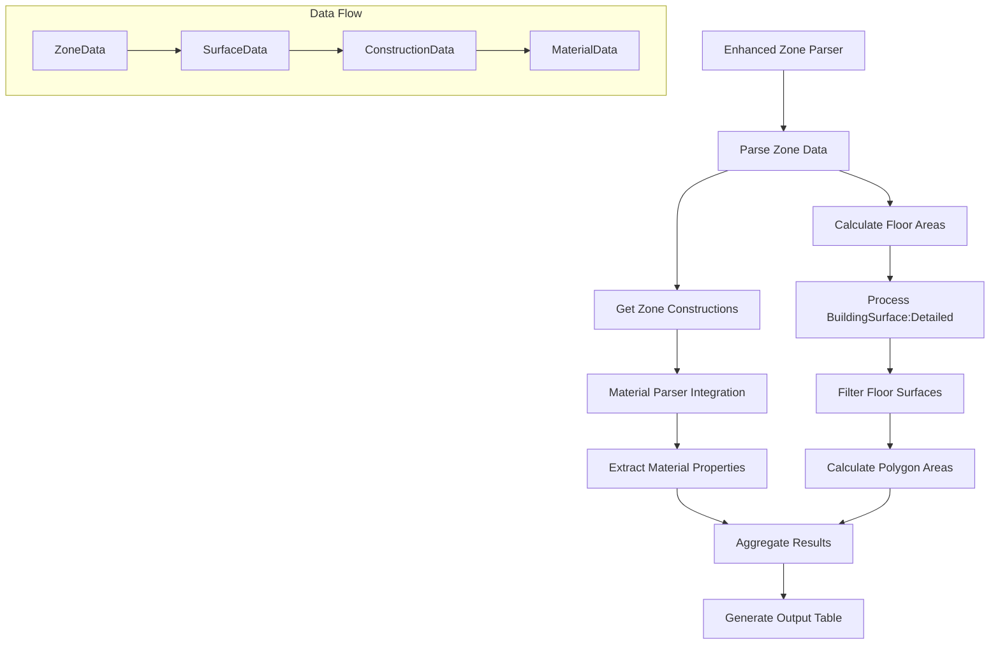

# Zone Parser Enhancement Specification

## Overview

This document outlines the implementation plan for enhancing the zone data parsing module to include detailed area calculations and integrate material data processing.

## Requirements

1. Parse and aggregate zone construction data
2. Calculate floor surface areas using BuildingSurface:Detailed geometry
3. Generate comprehensive output with areas and material properties

## Implementation Plan

### 1. New Class Structure

```python
class ZoneAreaAnalyzer:
    """
    Enhanced zone analysis combining area calculations and material properties.
    Builds on existing AreaParser and MaterialsParser functionality.
    """
    def __init__(self, data_loader: DataLoader):
        self.data_loader = data_loader
        self.zone_analysis_results = []

    def process_zone(self, zone_id: str) -> List[ZoneAnalysisResult]
    def calculate_floor_area(self, surface_data: SurfaceData) -> float
    def get_construction_properties(self, construction_id: str) -> Dict[str, float]
```

### 2. New Data Models

```python
@dataclass
class ZoneAnalysisResult:
    """Container for combined zone analysis data"""
    zone_id: str
    element_name: str
    element_type: str
    area: float
    conductivity: float
    area_conductivity: float
```

### 3. Data Flow



### 4. Implementation Phases

#### Phase 1: Surface Processing

1. Extend DataLoader

   - Add methods for BuildingSurface:Detailed access
   - Cache surface vertex data
   - Create zone-surface relationship helpers

2. Implement Area Calculations
   ```python
   def calculate_polygon_area(vertices):
       points_2d = np.array([(x, y) for x, y, z in vertices])
       x = points_2d[:, 0]
       y = points_2d[:, 1]
       return 0.5 * np.abs(np.dot(x, np.roll(y, 1)) - np.dot(y, np.roll(x, 1)))
   ```

#### Phase 2: Material Integration

1. Surface-Construction Mapping

   - Link surfaces to constructions
   - Extract material layers
   - Calculate composite properties

2. Data Aggregation
   - Combine area calculations with material properties
   - Generate zone-level summaries
   - Create detailed element breakdowns

### 5. Testing Strategy

#### Unit Tests

- Polygon area calculation validation
- Material property aggregation
- Surface filtering and processing

#### Integration Tests

- Zone-construction relationships
- Area calculations vs known values
- Full data flow validation

#### Test Data

```python
test_surface = {
    "surface_type": "Floor",
    "vertices": [
        (0, 0, 0),
        (10, 0, 0),
        (10, 10, 0),
        (0, 10, 0)
    ]
}
```

### 6. Output Format

The enhanced parser will generate a table with the following columns:

- Zone
- Element name
- Element type
- Area (m²)
- Conductivity (W/m·K)
- Area \* Conductivity (W/K)

## Implementation Notes

1. Error Handling

   - Validate surface geometry
   - Check for missing material properties
   - Handle incomplete zone data

2. Performance Considerations

   - Cache frequently accessed data
   - Optimize polygon calculations
   - Use efficient data structures

3. Integration Points
   - DataLoader extension
   - Existing parser interfaces
   - Report generation system

## Dependencies

- numpy for geometry calculations
- existing DataLoader infrastructure
- current parser implementations

## Migration Plan

1. Create new classes without modifying existing ones
2. Add integration points
3. Update reporting system
4. Run parallel validation
5. Switch to new implementation
